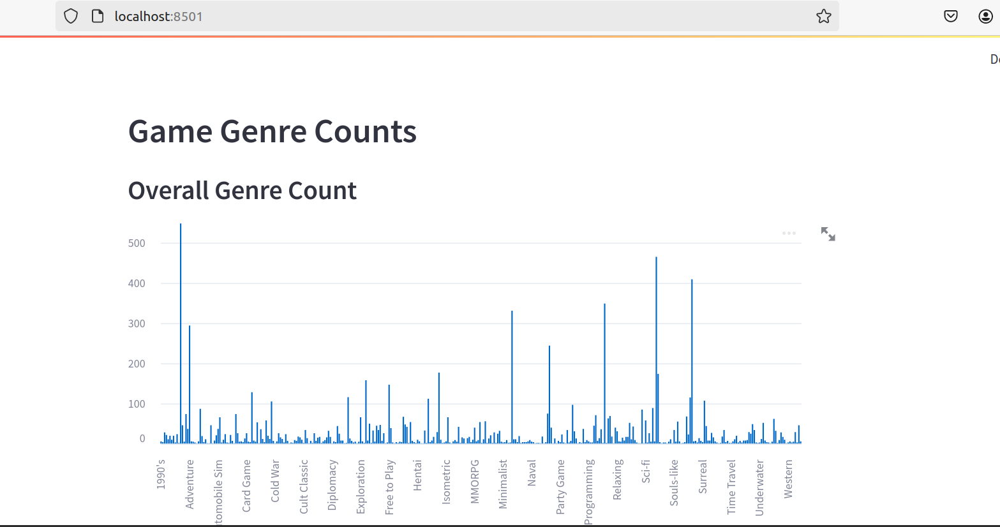

# Steam Scraper Project

Created by Brandon Kobayashi\
Partners: Jimmy Nguyen, Alvin Yu

# [NOTE]

This project is for educational purposes only.

## Before you run the steam scraper

Before running the steam scraper, there are 2 things you must check:

### 1.) Check your Python version

You can easily check your python version by going to your terminal and type the following:

```sh
python --version
```

I am currently using Python 3.12.3 and selenium 4.17.2 is compatiable with it.\
For the purpose of using this, make sure your Python version is compatible with selenium 4.17.2

### 2.) Getting Selenium

Make sure to download selenium as the scraper uses selenium for collecting data.\
If you have selenium, check what version you have with the command below. Otherwise, continue to the next command.

```sh
pip show selenium
```

To make sure you do not run into errors, download selenium 4.17.2

```sh
pip install selenium==4.17.2
```

# How to run the steam scraper application

- First, open the main.py file and set a directory you want to store your data that will be collected.
- Secondly, set the other parameters (as shown in the comments of the py file)
- Finally, run the code via the terminal and it should collect data and clean the data.

```sh
python main.py
```

(**Note**: The files should be put in the same directory)

## Things to Keep in Mind

- This steam scraper has only been tested on windows.
- The steam scraper still needs some improvements for the purpose of this project.
- Clean Data folder contains sample not important for the program to run. You do not need to download it unless you want to test out data analysis portion

# Running via Airflow

Assuming you have airflow installed somewhere, store the first_dag within the dags directory of airflow. We also could not get the data extraction to work via airflow so we extracted the data ahead of time. We mainly store the data and the Steam Sraper in the dags directory since we are using Docker containers. Once the data is extracted and stored, we can start our pipeline and it will clean and analyze the data for us.

# Starting Streamlit

To start up streamlit, head into the streamlit folder and type the following in the terminal.

```sh
docker-compose up 
```

Make sure your analysis.json file is within your streamlit/app directory, otherwise it will display an error.\
Once you have started streamlit, point your browser to `http://localhost:8501`


If it is working, it should look something like the following:

